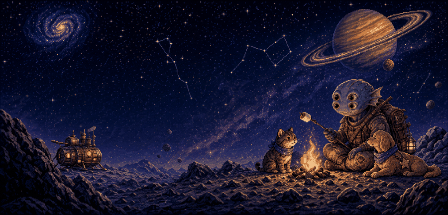

  

<h1 align="center">Jiabao Gao · Centauri_C</h1>

  Incoming Ph.D. Student in Artificial Intelligence · 2026 Cohort 
  The Chinese University of Hong Kong, Shenzhen × Shenzhen Loop Area Institute

  

  
  
  
  

> I want to chase questions to the edge of the universe — and still leave enough time to sit by a small fire and roast a marshmallow.

## Current orbit

I am an incoming joint Ph.D. student in **Artificial Intelligence** at **The Chinese University of Hong Kong, Shenzhen** and **Shenzhen Loop Area Institute**. I am completing my B.Sc. in Computer Science at CUHK-Shenzhen.

My research begins with a simple question:

> How can an intelligent agent understand not only **what** people say, but also **how**, **why**, and **in what situation** they say it — and use that understanding to interact meaningfully with the physical world?

I am particularly interested in advancing **speech understanding beyond transcription**. Human speech carries far more than words: emotion, rhythm, hesitation, emphasis, speaker state, social intent, and cues from the surrounding environment. I want to develop models that can perceive these signals, connect them with visual and contextual information, and form a richer understanding of people and their situations.

This goal brings together three closely connected research directions:

- **Speech & Multimodal Intelligence** — learning representations that jointly understand linguistic content, paralinguistic cues, visual context, and environmental signals
- **Interpretable AI** — revealing what multimodal models attend to, how they form judgments, and why they succeed or fail in real interactions
- **Embodied AI** — enabling agents to listen, see, reason, and act within dynamic physical environments rather than remaining isolated behind a text interface

My long-term goal is to translate these ideas into **reliable, understandable, and useful intelligent systems** that can participate in everyday life. I enjoy working across research questions, algorithms, data pipelines, evaluation, and deployment — from understanding a model's internal representations to building systems that people can actually interact with.

## Selected transmissions

| Work | What I did | Signal |
|---|---|---|
| [**Human or Machine? A Preliminary Turing Test for Speech-to-Speech Interaction**](https://openreview.net/forum?id=Pv5l6cvfno) | Co-first author; investigated how people perceive semantic, paralinguistic, emotional, and persona-level cues in speech interaction, and led the algorithm design of an interpretable AI judge built on Qwen2.5-Omni-7B. [Code](https://github.com/Carbohydrate1001/S2S-Turing-Test) | **ICLR 2026 Poster** · 2,968 human judgments · 9 S2S systems · 18 evaluation dimensions |
| [**Course & Exam Scheduler**](https://github.com/Carbohydrate1001/Course-Optimization) | Formulated large-scale binary integer programs and built an end-to-end institutional data pipeline with graceful handling of infeasible cases. | Deployed at the CUHK-Shenzhen Registry Office · supported scheduling for **4,000+ students** |
| [**2028 Olympics Prediction**](https://github.com/Carbohydrate1001/2028-Olympics-Prediction-2025-MCM-) | Built an XGBoost forecasting pipeline with TPE tuning, rolling features, statistical analysis, and automated processing of 230K+ records. | **2025 MCM Honorable Mention** |

## Research toolkit

  
  
  
  
  
  
  
  

`Speech Understanding` · `Speech LLMs` · `Multimodal Learning` · `Embodied AI` · `Human-AI Interaction` · `Interpretable AI`

## Milestones

- 🛰️ **Best Research Award**, CCF-SLAI Symposium Poster Session, 2026

## Beyond the terminal

When I am not training models or optimizing schedules, I am probably:

- making something by hand,
- learning about astronomy and the universe,
- photographing landscapes and collecting quiet moments in the natural world,
- spending time with cats, dogs, and other animals,
- building small games or side projects,
- or looking for a quiet campfire and a perfectly toasted marshmallow.

  <em>Curious about intelligence, people, and all the strange little worlds in between.</em>

